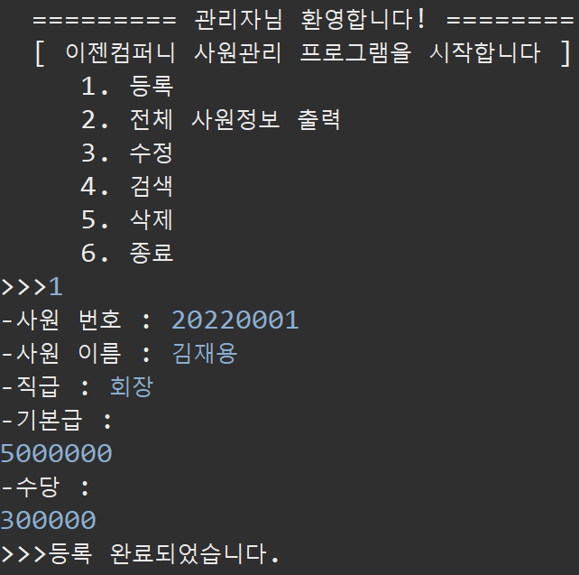
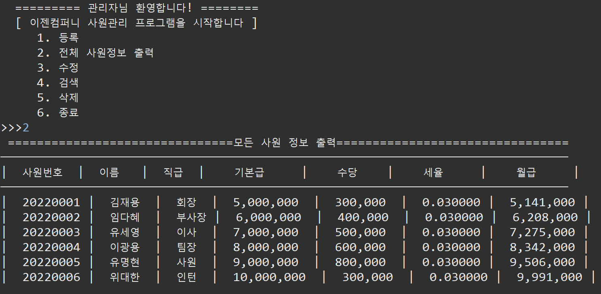
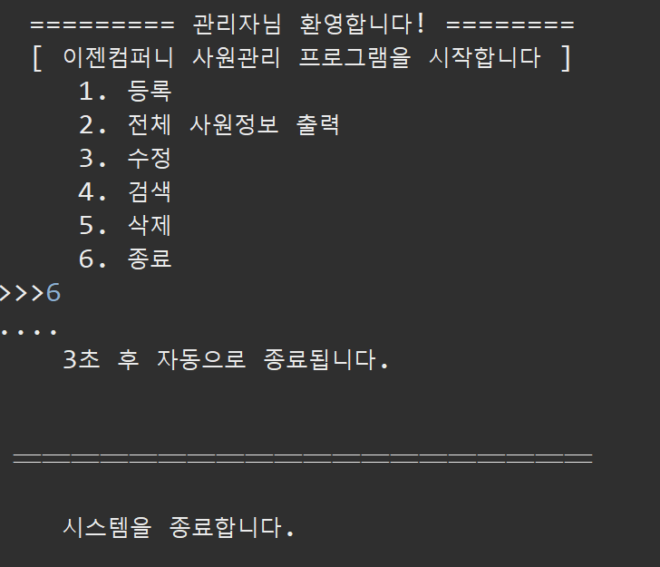

# **Project - Employee Management Program**  👥

 ## 💡 `Java` PROJECT    
---

### 🧾 프로젝트 소개 

---

>**ECLIPSE 환경 구축**

> 1. ECLIPSE 설치
> 2. JDK 설치

### [ ver_0.1 ]

(test를 위해 관리자 : 1 / 사용자 : 2
(추후 임시 번호 삭제 및 주석 해제 필요))

1. ID 및 Passowrd 입력 시 관리자 또는 사용자(누구누구) 모드로 전환 모두 추가 (코멘트 수정)

1-2. ID 및 Password 3회 입력 실패 시 접근 위반에 대한 안내 추가

1-3. 종료에 대한 딜레이 추가

2. 선택지 5번 선택(종료) 시 "프로그램을 종료합니다." 안내 멘트 추가

───────────────────────────────────────────────────────────────────────

### [ ver_0.2 ]

**1. 관리자 및 사용자 기능 수정**

 1. 입력 모드 수정

 2. 검색 모드 수정

───────────────────────────────────────────────────────────────────────

### [ ver_0.3 ]

**1.관리자 및 사용자 기능 분리 (ver_1)**

 - 관리자에게 모든 권한 부여 

  ```
         1. 등록 - 허가

         2. 출력 - 허가

         3. 수정 - 허가

         4. 검색 - 허가

         5. 종료 - 허가
     
   ```

  - 사용자에게 제한적 기능 부여

    ```
         1. 등록 - 사용 불가

         2. 출력 - 허가

         3. 수정 - 사용 불가

         4. 검색 - 허가

         5. 종료 - 허가
      
    ```
    
───────────────────────────────────────────────────────────────────────
### [ ver_0.4 ]

**1. 관리자 및 사용자 기능 분리 (ver_2)**

  - 관리자에게 모든 권한 부여 

    - 개인정보 외 모든 사항에 대하여 관리자 및 사용자에게 공통적으로 기능 부여
  
  
  - 사용자에게 제한적 기능 부여

    - 개인정보와 관련된 부분은 개인(해당 사용자)만이 조회


      ```
             1. 등록 : 관리자 전용, 사용자 전용 분리

             2. 출력 : 공통

             3. 수정 : 관리자만

             4. 검색 : 공통

             5> 종료 : 공통

      ```

───────────────────────────────────────────────────────────────────────

### [ ver_0.5 ]

**1. 관리자 및 사용자 모드**

  1. 연차휴가 추가

  2. 특별수당, 야근수당 등 초과 근무 수당 추가

  3. 퇴직금 및 연봉 인상률 추가

───────────────────────────────────────────────────────────────────────

### [ ver_0.6 ]

**1. 관리자 및 사용자 모드 취합 및 테스트**

**2-1. 로그인 이후 계속 로그인 해야 사용 가능 한 것 수정**

**2-2. 로그인 이후 로그인 입력 넘어가는 버그 수정**

**3. ['2. 출력'] 기능 -> '전체 | 사원정보' 출력하게끔 변경**

**4. '삭제' 기능 추가**

  ```

             1. 등록
         
             2. 전체 사원정보 출력
         
             3. 수정 
         
             4. 검색 
         
             5. 삭제
      
             6. 종료

   ```
+ 관리자 및 사용자 파일 분리
+ 관리자 및 사용자 분리에 따른 버그 수정(권한 포함)

---
---

- 관리자<br>
  - 로그인<br>
  <br>
  - 사원등록<br>
  <br>
  - 사원 전체 조회<br>
  <br>
  - 사원정보 수정 결과<br>
  <br>
  - 사원 개인정보 검색<br>
  <br>
  - 연차조회<br>
  <br>
  - 연차휴가 수당 조회<br>
  <br>
  - 초과근무수당 조회<br>
  <br>
  - 퇴직금 조회<br>
  <br>
  <br>
  - 사원 삭제<br>
  <br>
  

- 사용자
  - 사용자 전용 로그인<br>
  <br>
  - 사원등록<br>
  <br>
  - 사원 개인정보 검색<br>
  <br>
  - 사용자 사원 전체 조회 접근 제한<br>
  <br>
  - 사용자 사원수정 권한 접근 제한<br>
  <br>
  - 사용자 사원정보 삭제 접근 제한<br>
  <br>

- 기타(공통)
  - 종료<br>
  <br>
  - 타이머 함수<br>
  <br>

#### 코멘트
---
<br>
```
연차 조회 기능을 좀 더 다양한 경우의 수에 따라 세분화해서 구현하지 못해 아쉽고, 
프로젝트를 통해 실전에서 자바 프로그램을 직접 짜볼 수 있어서 좋은 경험이었습니다. 
```

---

<br>
```
깃을 많이 활용하지 못해 아쉽고 데이터 베이스를 활용하지 않아 데이터의 부재로 아쉽고 
자바코드로만 구현할수있는게 한계가 있다는점에 많은것을 배웠습니다.
```


---

<br>
```
팀원들과 서로 돕고 의견을 조율하며 많은 의지를 하게되었고 팀프로젝트를 할 때 
우선순위가 어떤것인지에 대해 알게되었으며, 기능구현에선 각 코드의 취합과정의 
어려움과 부족한 실력에 아쉬움이 남았다. 
```

---

<br>
```
팀워크를 통해 개발의 협업과정을 경험하면서 서로의 강점을 살려 맡은 바 프로젝트를 성실히 임하며 
각자의 부족한 부분을 채워주며 많은 것을 배울 수 있는 계기가 되었습니다.
서로 논의하고 새로운 것을 추가하며 수정해가는 과정에서 새로운 기능 구현 및 논리적 사고를 키울 수 있었지만, 
생각하는 것만큼 쉽게 이루어지지 않아 모든 것을 할 수 없었던 점, 
개발이라는 것이 쉽지 않다는 것을 다시하여금 깨닫게 합니다.
```

---

<br>
```
기간이 짧아서 기능을 모두 구현하지 못한 게 아쉬웠고,  
자바에 대한 이해도가 깊지 않아서 아직 공부를 더 해야겠다는 생각이 들었다.
```

---
---
---
